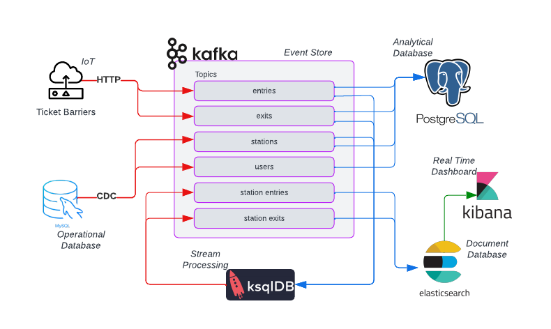
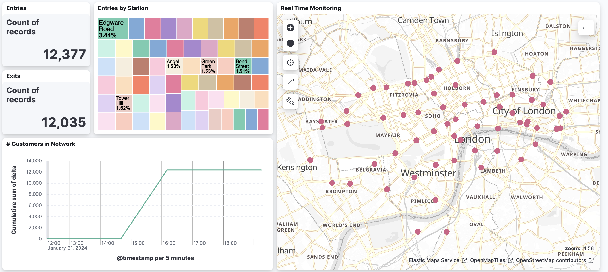

# TfL

## Streaming Patterns

Several patterns are common in streaming. In increasing order of maturity these are:
- Event Sink. Your business is already using streams. These can be ingested straight into your data warehouse to complement existing batch workloads, e.g. Marketing
- Replication. Replicate data from one place to another. Useful for serving data as a product or creating more fault-tolerant systems.
- Replication. Your business needs real time analytics for immediate decision making, e.g. Supply Chain & Logistics
- Microservices. Your business needs to operate in real time and has different services that need to talk to each other, e.g. Fraud Detection

The objective of this project is to demonstrate some of these patterns in Kafka

## Case Study

Transport for London needs to be able to ingest IoT and operational data for use in real time dashboards and for offline analysis. 

The solution architecture is shown below.
<p>
    
</p>

## Set Up

### Step 1 - Download connects
Download latest connectors, unzip and save under connect-plugins/

https://www.confluent.io/hub/confluentinc/kafka-connect-jdbc
https://www.confluent.io/hub/confluentinc/kafka-connect-elasticsearch

Save the MySQL JDBC driver under connect-plugins/kafka-connect-jdbc-10.7.4/jars
https://repo1.maven.org/maven2/com/mysql/mysql-connector-j/8.3.0/mysql-connector-j-8.3.0.jar

### Step 2 - Start containers

```
docker compose up --build
```
In addition to setting up the Confluent environemnt for Kafka, a mariadb will be spun with dummy stations and users loaded.


### Step 3 - Kafka Connect

Kafka Connect will look for drivers under CONNECT_PLUGIN_PATH when starting. 

Streaming from mariadb.tfl to Kafka

```
curl -X POST http://localhost:8083/connectors -H "Content-Type: application/json" -d '{
        "name": "jdbc_source_mariadb_01",
        "config": {
                "connector.class": "io.confluent.connect.jdbc.JdbcSourceConnector",
                "connection.url": "jdbc:mysql://mariadb:3306/tfl",
                "connection.user": "root",
                "connection.password": "root123",
                "topic.prefix": "",
                "catalog.pattern": "tfl",
                "numeric.mapping": "best_fit",
                "mode":"timestamp",
                "timestamp.column.name": "modified_date",
                "transforms":"copyFieldToKey,extractKeyFromStruct",
                "transforms.copyFieldToKey.type":"org.apache.kafka.connect.transforms.ValueToKey",
                "transforms.copyFieldToKey.fields":"name",
                "transforms.extractKeyFromStruct.type":"org.apache.kafka.connect.transforms.ExtractField$Key",
                "transforms.extractKeyFromStruct.field":"name"
                }
        }' | json_pp
```

List connectors
```
curl localhost:8083/connectors
```
Check a service is healthy
```
curl -s localhost:8083/connectors/jdbc_source_mariadb_01/status | json_pp
```

### Step 4 - Set up the Python environment

```
python3 -m venv .env
. .env/bin/activate
pip install -r requirements.txt
```

### Step 5 - Produce events

```
python produce_iot_to_kafka.py
```

### Step 6 - Process streams using ksql

Open the ksqldb-cli 

```
docker compose exec -it ksqldb-cli ksql http://ksqldb-server:8088
```

Join stations with entries and exits

```
set 'auto.offset.reset' = 'earliest';
drop stream if exists `station_entries`;
drop stream if exists `station_exits`;
drop stream if exists entries;
drop stream if exists exits;
drop table if exists stations_tb;
create table stations_tb (
    key STRING PRIMARY KEY,
    `name` STRING,
    `location` STRING
    ) 
WITH ( 
    kafka_topic = 'stations',
    key_format = 'KAFKA',  
    value_format = 'AVRO')
    ;
create stream entries (
    key STRING KEY, 
    `user` STRING,
    `delta` INT
) WITH ( 
    kafka_topic = 'entries',  
    value_format = 'JSON'
);
create stream exits (
    key STRING KEY, 
    `user` STRING, 
    `delta` INT
)  WITH ( 
    kafka_topic = 'exits', 
    value_format = 'JSON');
create stream `station_entries` as 
    select 
        e.key, 
        format_timestamp(from_unixtime(e.rowtime), 'yyyy-MM-dd''T''HH:mm:ss.SSSX', 'UTC') as "@timestamp", 
        e."user", 
        e."delta", 
        s."name" as "station", 
        s."location" 
    from entries e 
    join stations_tb s on e.key = s.key 
    emit changes; 
create stream `station_exits` as 
    select 
        e.key, 
        format_timestamp(from_unixtime(e.rowtime), 'yyyy-MM-dd''T''HH:mm:ss.SSSX', 'UTC') as "@timestamp", 
        e."user", 
        e."delta", 
        s."name" as "station", 
        s."location" 
    from exits e 
    join stations_tb s on e.key = s.key 
    emit changes; 
```

### Step 7 - Define index patterns for Elasticsearch

Open the elasticsearch CLI at http://localhost:5601/app/dev_tools#/console.

Defines mappings

```
PUT _component_template/barrier_mappings
{
  "template": {
    "mappings": {
      "properties": {
        "user": {
          "type": "keyword",
          "time_series_dimension": true
        },
        "station": {
          "type": "keyword",
          "time_series_dimension": true
        },
        "delta": {
          "type": "byte",
          "time_series_metric": "gauge"
        },
        "@timestamp": {
          "type": "date"},
        "location": {
          "type": "geo_point"}
      }
    }
  },
  "_meta": {
    "description": "Mappings for entry data"
  }
}
```

Define which index_patterns to match against, as well as defining the indices as time_series
```
PUT _index_template/barrier_template
{
  "index_patterns": ["station_entries","station_exits"],
  "data_stream": { },
  "template": {
    "settings": {
      "index.mode": "time_series",
      "index.routing_path": [ "station", "user" ]
    }
  },
  "composed_of": [ "barrier_mappings"],
  "priority": 500,
  "_meta": {
    "description": "Template for entries data"
  }
}
```

### Step 8 - Consume into elasticsearch

```
python consume_kafka_to_elasticsearch.py
```

### Step 9 - Create Kibana dasbhoard

Set up data views to match station_entries and station_exits. Elastic search prefers denormalised streams.

<p>
    
</p>


## Scratch

```
curl localhost:8083/connectors

curl -X DELETE localhost:8083/connectors/elasticsearch-entries-sink
curl -X DELETE localhost:9200/entries


curl -X PUT localhost:9200/entries -H 'Content-Type: application/json' -d'
{
"mappings" : {
  "properties" : {
     "data" : {
        "properties" : {
             "ts" : {
                 "type" : "date",
                 "format" : "yyyy-MM-dd HH:mm"
            }
        }
    }
        }
    }         
}' | json_pp


curl -X POST http://localhost:8083/connectors -H 'Content-Type: application/json' -d \
'{
  "name": "elasticsearch-entries-sink",
  "config": {
    "connector.class": "io.confluent.connect.elasticsearch.ElasticsearchSinkConnector",
    "tasks.max": "1",
    "topics": "entries",
    "key.ignore": "true",
    "schema.ignore": "true",
    "connection.url": "http://elastic:9200",
    "type.name": "_doc",
    "name": "elasticsearch-entries-sink",
    "value.converter": "org.apache.kafka.connect.json.JsonConverter",
    "value.converter.schemas.enable": "false"
  }
}' | json_pp

curl 'localhost:9200/entries/_search?pretty'

curl 'localhost:9200/stations/_count?pretty'
curl 'localhost:9200/entries/_search?pretty'
curl 'localhost:9200/exits/_count?pretty'


curl -X PUT localhost:9200/entries -H 'Content-Type: application/json' -d'
{
  "mappings": {
    "properties": {
      "staion":    { "type": "integer" },  
      "user":  { "type": "keyword"  }, 
      "ts":   { "type" : "date", "format" : "yyyy-MM-dd HH:mm"}     
    }
  }
}' | json_pp


curl -X PUT localhost:9200/entries -H 'Content-Type: application/json' -d'
{
"mappings" : {
  "properties" : {
     "data" : {
        "properties" : {
             "ts" : {
                 "type" : "date",
                 "format" : "yyyy-MM-dd HH:mm"
            }
        }
    },
    "metadata" : {
        "properties" : {
             "station" : { "type" : "text" },
             "user" : { "type" : "text" }
                }
            }
        }
    }         
}' | json_pp

curl -X POST "localhost:9200/entries/_search?size=0&pretty" -H 'Content-Type: application/json' -d'
{
  "aggs" : {
    "types_count" : { "value_count" : { "field" : "type" } }
  }
}
'


curl -X POST http://localhost:8083/connectors -H 'Content-Type: application/json' -d \
'{
  "name": "elasticsearch-entries5-sink",
  "config": {
    "connector.class": "io.confluent.connect.elasticsearch.ElasticsearchSinkConnector",
    "tasks.max": "1",
    "topics": "entries",
    "key.ignore": "true",
    "schema.ignore": "true",
    "connection.url": "http://elastic:9200",
    "type.name": "_doc",
    "name": "elasticsearch-entries-sink",
    "value.converter": "org.apache.kafka.connect.json.JsonConverter",
    "value.converter.schemas.enable": "false"
  }
}' | json_pp


curl -X PUT curl -X POST "localhost:9200//_index_template/metrics-laptop -H 'Content-Type: application/json' -d \
'{
  "index_patterns": [
    "metrics-laptop-*"
  ],
  "data_stream": {},
  "priority": 200,
  "template": {
    "settings": {
      "index.mode": "time_series"
    },
    "mappings": {
      "properties": {
        "host.name": {
          "type": "keyword",
          "time_series_dimension": true
        },
        "packages.sent": {
          "type": "integer",
          "time_series_metric": "counter"
        },
        "memory.usage": {
          "type": "double",
          "time_series_metric": "gauge"
        }
      }
    }
  }
}'


curl -X GET "localhost:9200/entries/_search?pretty" -H 'Content-Type: application/json' -d'
{
  "aggs": {
    "my-agg-name": {
      "terms": {
        "field": "my-field"
      }
    }
  }
}
'
